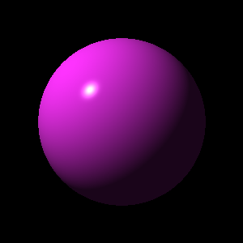

# MyElixirRayTracer

A ray tracer implementation written in Elixir following the book "The Ray Tracer Challenge" by Jamis Buck.

## Start the project

    mix start

Then open `/tmp/sphere.ppm` image:

A ppm file is a very simple file image format.

On MacOS, Preview can natively open the file; for other OSes there are many free options (also online).