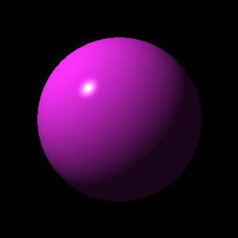

# MyElixirRayTracer

A ray tracer implementation written in Elixir following the book "The Ray Tracer Challenge" by Jamis Buck.



## Requirements

- Elixir 1.14+ / Erlang 25+ (or use [asdf](https://asdf-vm.com) with the included `.tool-versions`)

## Without Phoenix — render to file

```bash
mix deps.get
mix start
```

Opens the ray tracer, renders a sphere and writes the result to `/tmp/sphere.ppm`.

PPM is a simple image format. On macOS, Preview opens it natively; on other systems any image viewer or online converter will work.

## With Phoenix — live rendering in the browser

```bash
mix deps.get
mix phx.server
```

Then open [http://localhost:4000](http://localhost:4000) and click **Start Render** to watch the image appear row by row in real time.

## Run the tests

```bash
mix test
```
