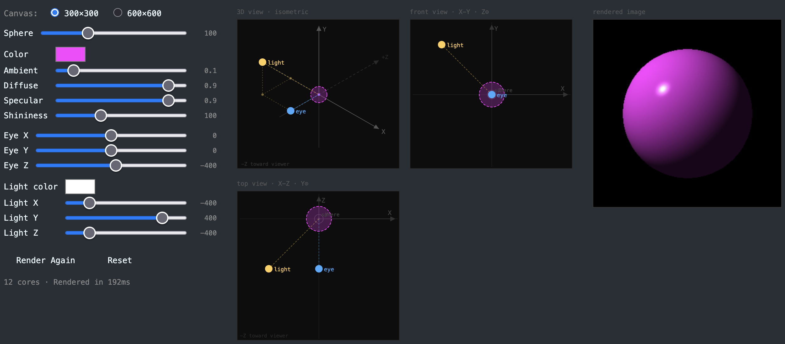

# MyElixirRayTracer

A ray tracer implementation written in Elixir following the book "The Ray Tracer Challenge" by Jamis Buck.


## Requirements

- Elixir 1.14+ / Erlang 25+ (or use [asdf](https://asdf-vm.com) with the included `.tool-versions`)

## Without Phoenix — render to file

```bash
mix deps.get
mix start
```

Opens the ray tracer, renders a sphere and writes the result to `/tmp/sphere.ppm`.

PPM is a simple image format. On macOS, Preview opens it natively; on other systems any image viewer or online converter will work.

## With Phoenix — live rendering in the browser

```bash
mix deps.get
mix phx.server
```

Then open [http://localhost:4000](http://localhost:4000) and click **Start Render** to watch the image appear row by row in real time.

### The web UI



The page is laid out in responsive blocks that reflow as the window narrows:

- **Settings** — interactive controls that update the scene diagrams live:
  - **Canvas** — output image resolution (300×300 or 600×600); this only affects the rendered image, not the scene.
  - **Sphere** — the sphere radius in world units.
  - **Material** — color picker plus Phong parameters (ambient, diffuse, specular, shininess).
  - **Eye** — camera position (X / Y / Z).
  - **Light** — point-light color and position (X / Y / Z).
  - **Render Again** / **Reset** buttons, the number of CPU cores used, and the last render time.

- **Scene diagrams** — three live schematic views of the scene, showing the sphere
  (drawn in the selected material color), the eye (blue) and the light (yellow):
  - **3D view** — an isometric projection with X/Y/Z axes and coordinate drop-lines for each point.
  - **front view (X-Y)** and **top view (X-Z)** — orthographic projections; the third axis points out of the page (⊙).

- **Rendered image** — the ray-traced canvas, streamed row by row over Phoenix PubSub as it is computed.

Renders are rate-limited to 20 per minute per client IP.

## Run the tests

```bash
mix test
```
